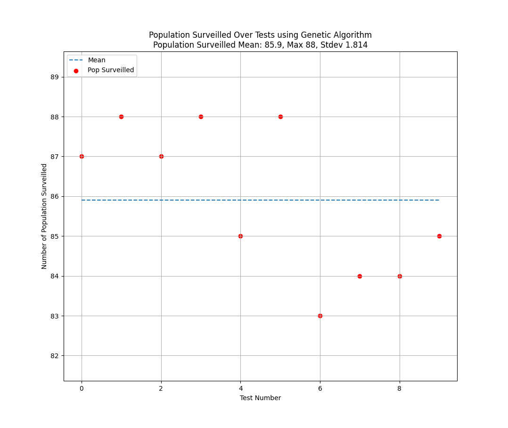
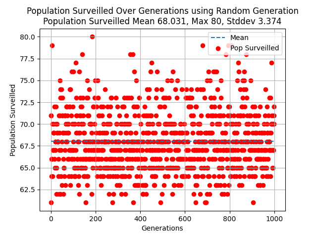
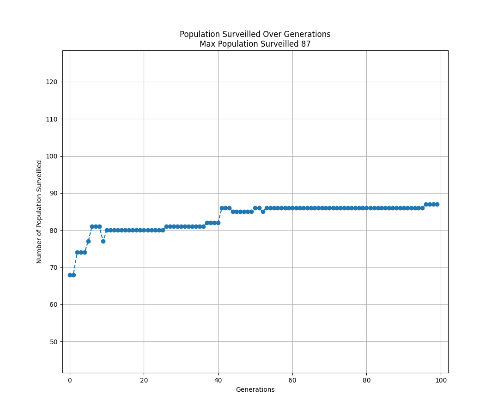

### Panopticon: Genetic Algorithm to maximze surveillance.

##### Project for AI Final Assignment:

This project, Panopticam, aims to use a Genetic Algorithm to optimise the placement of a limited set of cameras such that the cameras surveil the maximum number of a randomly distributed population.

This project creates a basic model of a distributed population, modelled as a randomly generated set of coordinates distributed on a 2D plane. Then by implementing a Genetic Algorithm, with an evaluation model drawn from the literature, it will seek to find a placement of surveillance cameras n this plane such that the maximum number of the randomly distributed populace is under the coverage of the cameras.

##### Results:

It is clear that the Genetic Algorithm produces significantly more optimum results then random samples. It is not conclusive how far from optimum the results of the Genetic Algorithm are. Though in earlier testing the highest result seen was 89 citizens, this was never repeated. This lack of  eproducibility, and the variability of each test, is a result of the non-deterministic nature of Genetic Algorithms. 88 citizens surveilled was consistently produced in testing runs. Based of the limited area of the map the camera range can cover, with the cameras covering 28% of the map,  urveilling 43% of the randomly distributed population seems a strong result. We can see that the mean of the random sample approaches the camera coverage with 34% of the population surveilled.

Testing the Genetic Algorithm against random samples is a easy hurdle to
beat. This is not as conclusive as testing the Genetic Algorithm against an known
optimum solution. In further analysis a known optimum solution should become the basis
for evaluation.

However we can see across the various runs of the GA a convergence to relatively stable result which suggests either a limit of the algorithm, or an approach towards a relatively optimum converage.

##### Ethical Notes:

Obviously this is a tongue in cheek. Don't be evil, but like actually don't be.

##### Requirements:
- matplotlib
- numpy
- python3.8
